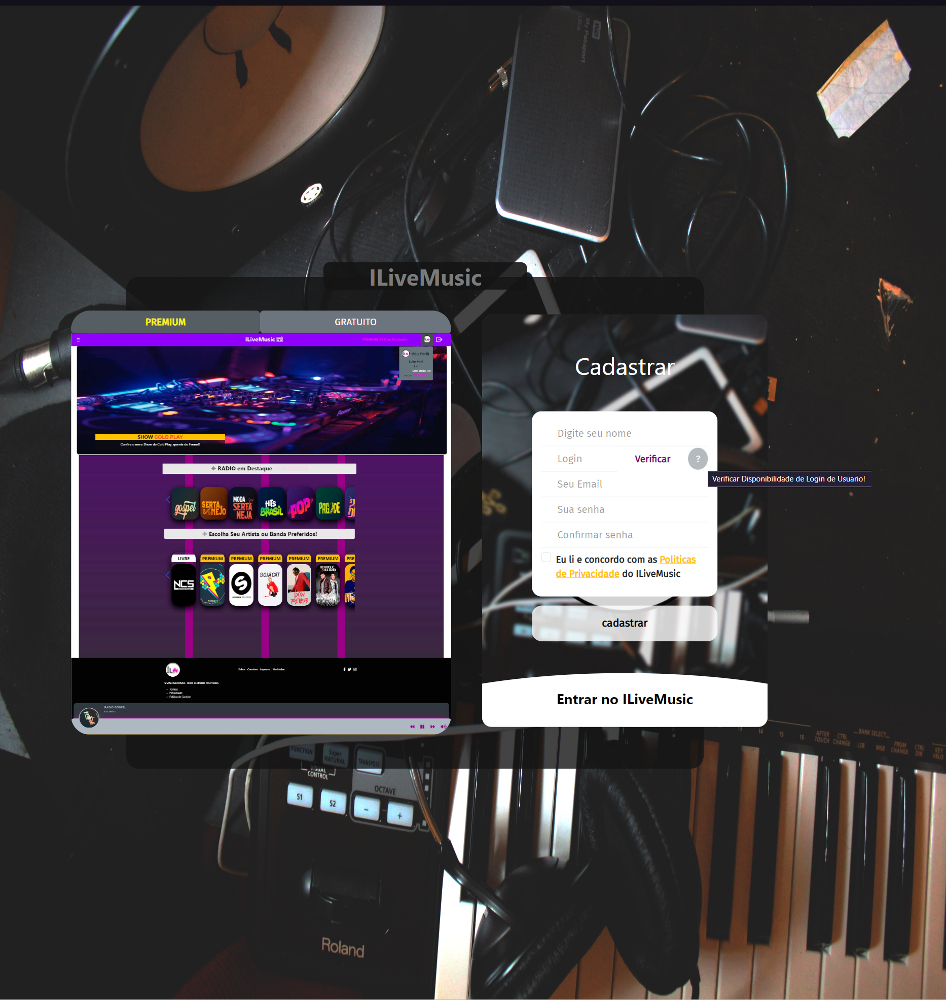
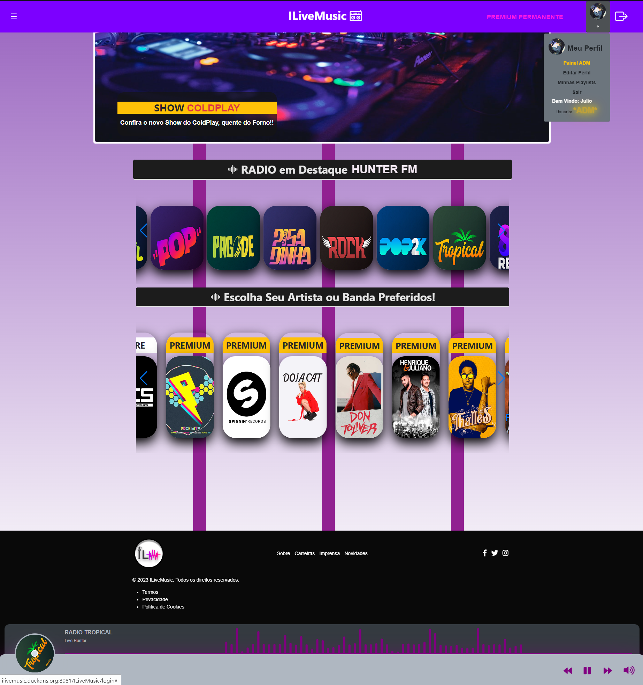
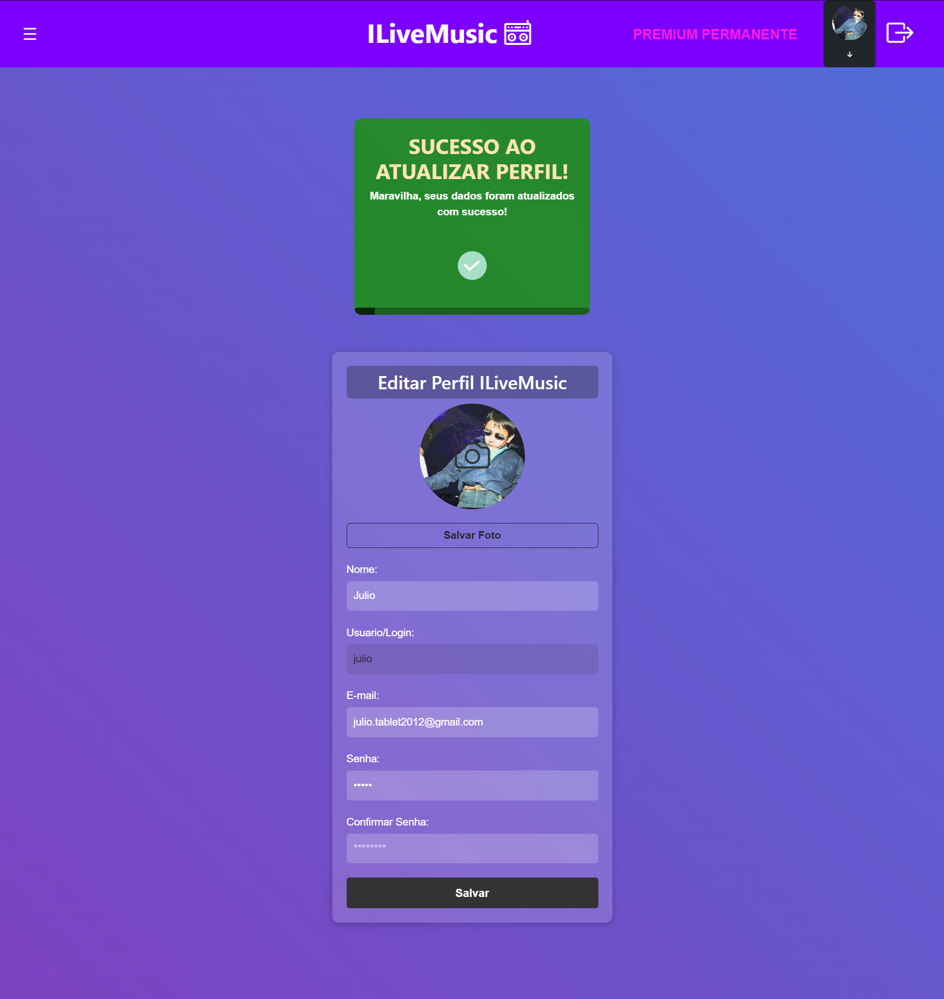
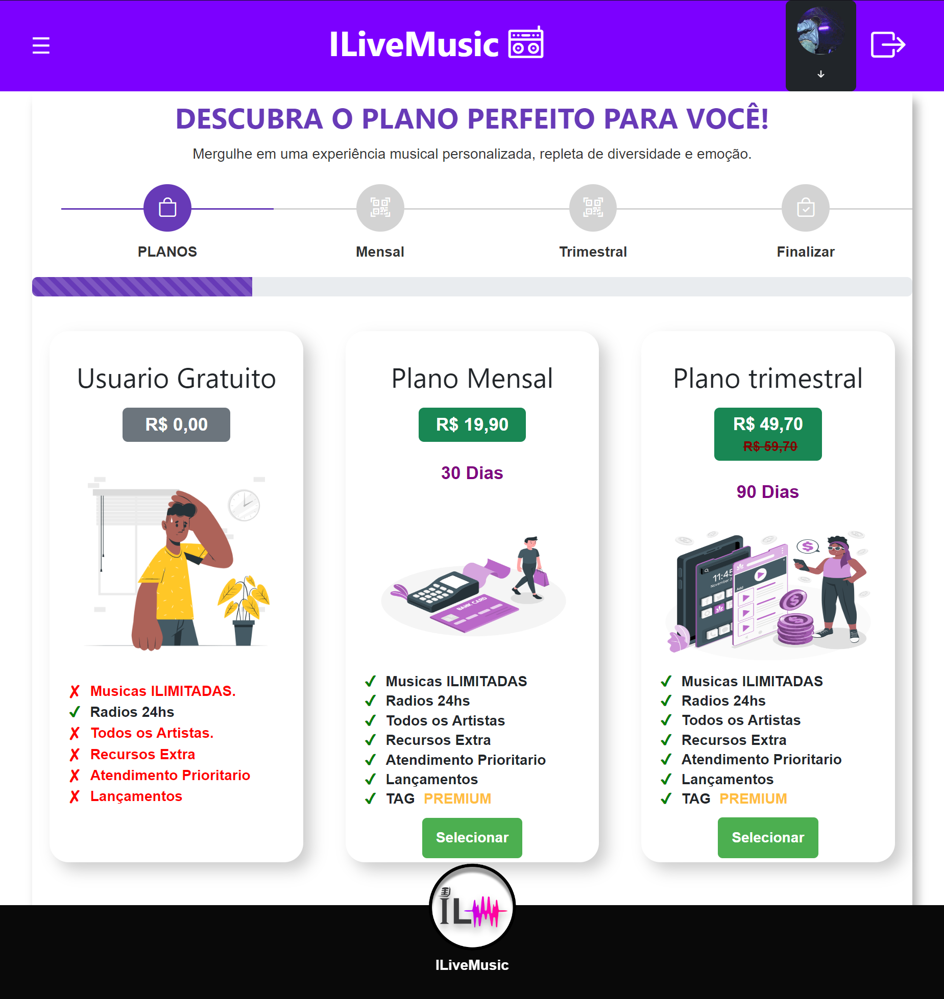
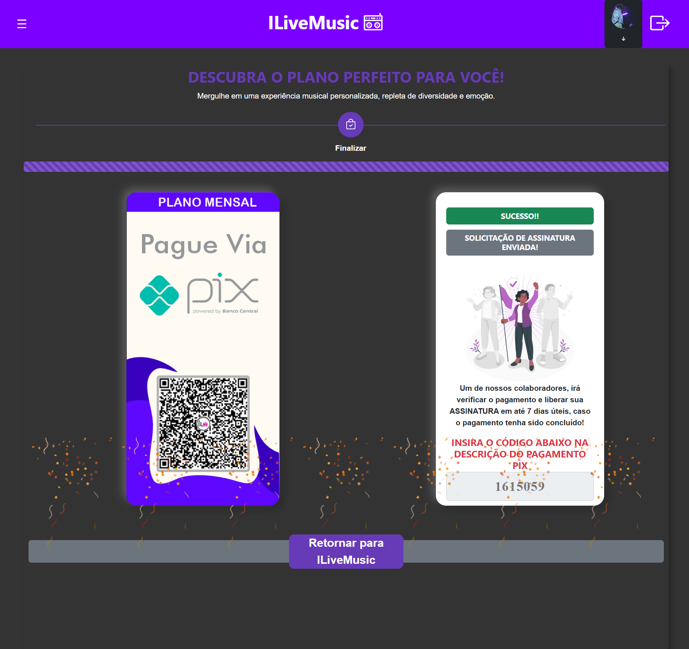
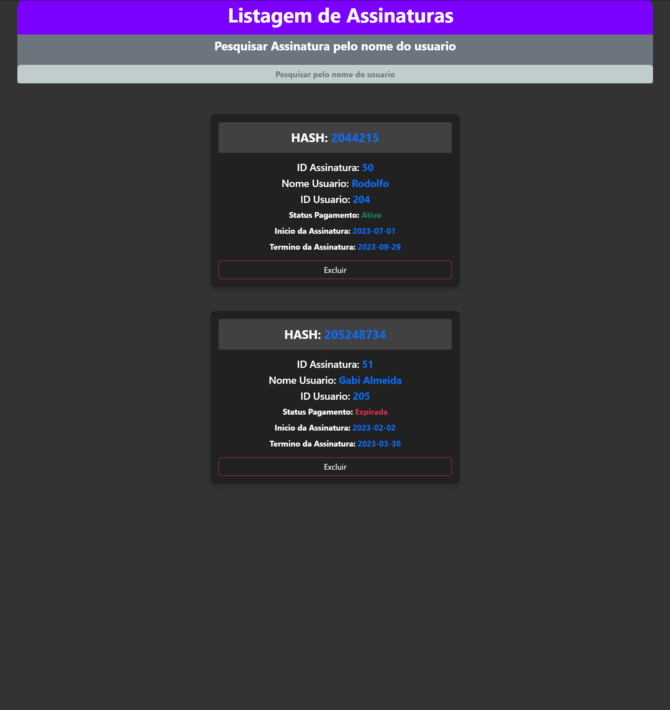
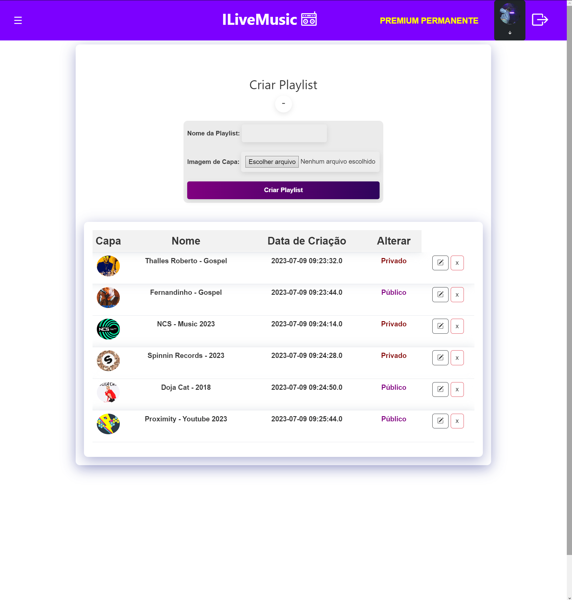

# ILiveMusic - Aplicação de Streaming de Música

Este é o arquivo README para a aplicação de streaming de música ILiveMusic, desenvolvida em Java utilizando a IDE Netbeans 8.2. A aplicação segue a estrutura web e utiliza o padrão MVC (Model-View-Controller) com DAO (Data Access Object).

## Resumo

A aplicação ILiveMusic oferece acesso a rádios 24/7 e playlists de músicas diversas, tanto para usuários gratuitos quanto para usuários PREMIUM. Os usuários podem realizar cadastro, edição de perfil, administração, restrições, assinaturas, solicitações de pagamento, criação de playlists e muito mais.

## Funcionalidades

A aplicação possui as seguintes funcionalidades:

### Página de Login/Cadastro

A página de Login/Cadastro permite que os usuários se cadastrem na plataforma, verifiquem a disponibilidade do login desejado e acessem os termos e condições de uso. Essa página fornece informações sobre quais dados são coletados dos usuários e como são processados.

Na seção de cadastro, os usuários podem preencher campos como nome, login, email, senha e confirmar senha. Há também uma caixa de seleção para confirmar a concordância com as regras estabelecidas. Além disso, a página inclui uma área de login, onde os usuários podem inserir suas credenciais de login (login e senha).

A página de Login/Cadastro utiliza cards ilustrativos animados para fornecer feedback visual aos usuários. Esses cards indicam se o usuário está restrito, se a senha está incorreta ou se o cadastro foi efetuado com sucesso. Além disso, há um carrossel lateral que oferece uma pré-visualização das páginas de um usuário gratuito e de um usuário PREMIUM, mostrando as diferentes funcionalidades disponíveis para cada tipo de usuário.

### Página Index

A página Index é a página inicial do aplicativo, que oferece uma experiência imersiva aos usuários. Possui os seguintes recursos:

- Carrossel de Eventos: Exibe um carrossel com cards de eventos, permitindo que os usuários tenham acesso rápido e fácil às informações sobre eventos importantes.

- Carrosséis de Radios 24/7: Apresenta carrosséis com listas de rádios 24/7, tanto gratuitas quanto premium. Os usuários gratuitos têm acesso apenas às rádios gratuitas, enquanto os usuários premium têm acesso a todas as rádios. Cada card de rádio exibe uma tag indicando se é gratuito ou premium.

- Carrosséis de Playlists: Mostra carrosséis com listas de playlists de vários artistas, disponíveis tanto para usuários gratuitos quanto premium. Os usuários gratuitos podem acessar apenas as playlists gratuitas, enquanto os usuários premium têm acesso a todas as playlists. Cada card de playlist exibe uma tag indicando se é gratuito ou premium.

- Player de Música: Apresenta um player de música totalmente personalizado e aprimorado, utilizado para reproduzir as rádios 24/7 disponíveis para os usuários gratuitos. O player oferece controles para reproduzir/pausar, avançar ou retroceder para a próxima música, avançar ou retroceder no tempo da música e ajustar o volume. Quando a última música da lista é reproduzida, a próxima música será a primeira, garantindo um loop infinito. O player está sempre visível no rodapé da página.

- Menu Sidebar: Inclui um menu sidebar com opções para editar o perfil do usuário e selecionar o modo claro/escuro da interface. A preferência de modo claro/escuro é armazenada localmente no armazenamento do navegador (localStorage) e se reflete em todas as páginas do aplicativo.

- Menu Efeitos Premium: Disponível apenas para usuários premium, oferece opções de Efeitos Centro e Efeitos Laterais. Esses efeitos personalizam a página Index, tornando-a única para os usuários premium.

- Menu no Navbar: O navbar contém um menu que oferece acesso ao painel de administração para usuários administradores, opção para editar o perfil, acesso às "Minhas Playlists" para usuários premium e opção de sair. Abaixo do menu, há uma animação de marquee que exibe a saudação "Bem-vindo(a) + nome do usuário" e o tipo de conta do usuário (ADM, PREMIUM ou gratuito). O navbar também exibe a frase "SEJA PREMIUM" para usuários que ainda não possuem assinatura premium, mostrando quantos dias restam para usuários com assinatura premium. Ao clicar em "SEJA PREMIUM", os usuários são redirecionados para a página de planos de assinatura. O botão de "SAIR" permite desconectar da conta atual.

### Página Editar Perfil

A página Editar Perfil permite que o próprio usuário faça alterações em seu perfil. Os seguintes recursos estão disponíveis:

- Edição de Imagem de Perfil: O usuário pode selecionar uma nova imagem de perfil para ser exibida em sua conta. A página suporta imagens nos formatos JPG, PNG, JPEG e GIF, com um tamanho máximo de 5 MB.

- Alteração de Nome: O usuário pode editar seu nome, permitindo que ele atualize as informações pessoais conforme necessário.

- Atualização de Email: É possível alterar o endereço de email associado à conta. O usuário pode inserir o novo email desejado.

- Mudança de Senha: Caso o usuário deseje alterar sua senha, ele pode inserir a senha atual e definir uma nova senha. A confirmação da nova senha é exigida para garantir que não haja erros de digitação.

- Login: O campo de login não é editável nesta página, pois ele é único e serve como identificador único do usuário na plataforma.

A página Editar Perfil oferece uma interface intuitiva e fácil de usar, permitindo que os usuários façam alterações em seu perfil de forma conveniente e segura.

### Página Planos de Assinatura

A página Planos de Assinatura exibe os diferentes planos disponíveis para assinatura na plataforma. Os seguintes recursos estão presentes:

- Cards de Planos: São exibidos cards com informações detalhadas sobre cada plano disponível. Isso inclui os planos gratuito, mensal e trimestral. Cada card destaca as vantagens e benefícios oferecidos pelo plano, detalhando o que está incluído e o que os usuários podem aproveitar ao assinar.

- Desconto no Plano Trimestral: O plano trimestral exibe um valor de desconto especial de -R$10,00 "BRL", tornando essa opção mais atrativa para os usuários. Essa informação é destacada no card do plano trimestral.

- Processo de Solicitação de Assinatura: Ao selecionar um dos cards de plano, o usuário avançará para a próxima etapa do processo de solicitação de assinatura. Nessa etapa, é exibido um card informativo destacando a importância de enviar o código HASH único na descrição do pagamento PIX. Esse código HASH é gerado aleatoriamente e serve para identificar o pagamento e vinculá-lo à assinatura do usuário.

- Confirmação da Compra: Ao clicar em "Confirmar Compra", um card é exibido, reforçando a atenção do usuário para a necessidade de inserir o código HASH na descrição do pagamento PIX. Caso o usuário clique em "Cancelar" ou "Resetar" antes de confirmar a compra, o processo de solicitação será cancelado. No entanto, ao clicar em "Confirmar Compra", o usuário avançará para uma nova tela de finalização de pagamento.

- Tela de Finalização de Pagamento: Nessa tela, após passar por duas animações de checkout, é exibida uma animação de confetes estourando em três vezes. À esquerda, um card apresenta o QR CODE do pagamento PIX, e à direita, um card informa que a solicitação de assinatura foi enviada com sucesso. O texto também informa que um colaborador verificará o pagamento, e, caso seja efetuado com sucesso, a assinatura será liberada na conta do usuário de acordo com o plano adquirido.

- Código HASH Aleatório: Logo abaixo, em destaque vermelho, é exibido o CÓDIGO HASH aleatório e único. Esse código é gerado pelo sistema, e caso já exista um código igual, será gerado um novo automaticamente. O usuário deve inserir esse código no pagamento PIX para que seja corretamente identificado e vinculado à sua assinatura. É importante destacar que, se o pagamento não for identificado (ou seja, o usuário não efetuar o pagamento), o sistema excluirá automaticamente a solicitação gerada, caso o status da solicitação de pagamento esteja pendente por mais de 30 dias.

A página Planos de Assinatura oferece uma experiência completa ao usuário, fornecendo informações claras e orientações sobre o processo de assinatura, garantindo uma transição suave para a finalização do pagamento e a ativação da assinatura.

### Página Painel ADM

Ao entrar na página Painel ADM, o administrador terá acesso aos menus e à documentação da administração, que resume cada função e descreve como atuar dentro da comunidade como colaborador da equipe. Além disso, a página possui um botão para alternar entre os modos claro e escuro, afetando todas as demais páginas da aplicação de acordo com a seleção do administrador.

A página oferece os seguintes recursos:

- Cadastro de Usuário: Ao selecionar essa opção no menu, o administrador terá acesso ao formulário de cadastro de usuário. Nesse caso, não é necessário marcar a caixa de confirmação dos termos, e o administrador poderá escolher o tipo de usuário a ser cadastrado (comum, premium ou administrador). A senha não precisa ser confirmada no momento do cadastro, pois o usuário poderá alterá-la posteriormente, se necessário.

- Usuários: Ao selecionar essa opção no menu, será exibida uma lista de todos os usuários cadastrados na plataforma. Cada usuário é representado com a foto, nome, ID, login, email e senha ocultada por asteriscos (***), pois a senha é privada. Além disso, é exibido o status da assinatura do usuário. Para usuários administradores, o status aparece como "Premium: Permanente". Para usuários premium comuns, é mostrada a quantidade de dias restantes em sua assinatura. Também é exibido o tipo de conta do usuário (comum, premium, administrador ou banido). Quando um usuário está banido, significa que ele possui uma restrição ativa que ainda não expirou. É possível pesquisar um usuário filtrando pelo nome, além de editar ou excluir um usuário. Para evitar exclusões acidentais, ao selecionar a opção de exclusão, será exibido um popup de confirmação.

A página Painel ADM oferece ao administrador todas as ferramentas necessárias para gerenciar os usuários da plataforma, permitindo cadastrar novos usuários, visualizar informações relevantes e realizar ações como edição e exclusão, com medidas de segurança para evitar erros ou exclusões acidentais.

### Página Editar Usuário - PAINEL ADM

A página Editar Usuário do PAINEL ADM exibe todos os dados relevantes do usuário selecionado na lista de usuários do painel administrativo. Os dados exibidos incluem nome, login, email, senha, tipo de conta e restrições do usuário, caso haja alguma. As restrições são exibidas com informações sobre se estão ativas ou expiradas.

Nessa página, é possível editar todos os dados do usuário, incluindo a criação ou atualização de restrições. Ao atualizar uma restrição, é possível remover o status ativo da mesma, mas a restrição em si não será excluída. Isso é importante para manter um histórico detalhado de cada usuário e identificar se houve reincidência de restrições anteriores.

Ao criar uma restrição, é possível selecionar uma data de término para que ela expire. O sistema removerá automaticamente a restrição quando essa data for atingida. Além disso, é possível selecionar o motivo da restrição. Quando um usuário com restrição ativa tentar efetuar o login em sua conta, será exibido um card personalizado informando que a conta está restrita. O card informará a data em que a restrição será removida e o motivo da restrição, para que o usuário tenha ciência do motivo pelo qual está restrito.

A página Editar Usuário do PAINEL ADM é visualmente aprimorada, contando com cards ilustrativos animados que se atualizam conforme as alterações feitas pelo administrador. Essa página oferece uma interface intuitiva e eficiente para gerenciar os dados dos usuários, incluindo a aplicação e remoção de restrições, proporcionando um controle completo sobre as contas de usuário no sistema.

### Página de Pagamentos no Painel de Administração

A página de pagamentos lista todas as solicitações de pagamento feitas pelos usuários ao selecionarem os planos de assinatura na tela de Planos de Assinatura. Cada solicitação gera um código HASH aleatório único, que pode ser usado para filtrar a pesquisa. O código HASH é gerado concatenando a ID do usuário com um código aleatório único, o que permite uma identificação mais ágil do HASH.

As solicitações de pagamento são exibidas com os seguintes campos:
- Código HASH: identificação única da solicitação de pagamento.
- ID do usuário: identificação do usuário que fez a solicitação.
- Status do Pagamento: mostra se o pagamento ainda está pendente de verificação por parte da equipe responsável.
- Data de Expiração do Pagamento: indica a data de 31 dias, após a qual o sistema exclui automaticamente a solicitação de pagamento do banco de dados, evitando a acumulação de dados desnecessários.

Quando um pagamento é identificado pelo banco e o usuário envia o código HASH na descrição do pagamento, a equipe responsável verifica o código HASH nesta página. Com base nessa verificação, a assinatura correspondente ao código HASH é ativada ou não. Também é exibida a quantidade de dias premium que corresponde à duração da assinatura selecionada pelo usuário.

Ao clicar em "Ativar Assinatura", o administrador tem acesso a todos os dados relevantes para registrar a ativação da assinatura. Em caso de promoções ou ofertas especiais, como "Assine o plano trimestral de 90 dias e ganhe mais 10", o administrador pode inserir a quantidade de dias correspondente à promoção, garantindo que o usuário receba o benefício. Após a ativação da assinatura, um card é exibido informando se a assinatura foi ativada ou não.

### Página Assinaturas - PAINEL ADM

A página Assinaturas do PAINEL ADM lista todas as assinaturas efetivadas que foram ativadas a partir de uma solicitação de pagamento. Ela exibe os seguintes campos:

- HASH: Referente ao código HASH da solicitação de pagamento que foi efetuada para aquela assinatura.
- ID da Assinatura: Identificador único da assinatura.
- Nome do Usuário: Nome do usuário associado à assinatura.
- ID do Usuário: Identificador único do usuário.
- Status do Pagamento: Pode ser "ativo" se a data de término da assinatura ainda não foi atingida, ou "expirada" se a data de término já foi alcançada.
- Início da Assinatura: Data de início da assinatura.
- Término da Assinatura: Data de término da assinatura.

Na página Assinaturas, há um botão para exclusão da assinatura, com uma pré-confirmação para evitar exclusões acidentais. O próprio sistema verifica se a assinatura já atingiu sua data de término e, nesse caso, o sistema removerá automaticamente a assinatura do usuário.

Essa página fornece uma visão geral das assinaturas ativas e expiradas no sistema, permitindo ao administrador gerenciar as assinaturas dos usuários de forma eficiente.

### Página Minhas Playlists

A página Minhas Playlists permite aos usuários criar e gerenciar suas playlists de músicas. No entanto, é importante ressaltar que, na data atual (14/07/2023), o recurso de músicas está em desenvolvimento e algumas funcionalidades ainda estão sendo implementadas. 

Atualmente, os usuários podem criar playlists fornecendo um título e selecionando uma capa para a playlist. As imagens de capa estão sujeitas a restrições de formato, como JPEG, JPG, PNG, GIF, e tamanho máximo de 5MB. Além disso, existe um limite de 10 playlists por usuário.

As playlists são registradas como públicas por padrão, mas haverá uma alteração futura para permitir que os usuários escolham se desejam que suas playlists sejam privadas ou públicas durante o cadastro.

Na página Minhas Playlists, os usuários têm a opção de excluir uma playlist, mas é necessária uma pré-confirmação para evitar exclusões acidentais. O botão de edição de playlist ainda está em desenvolvimento e será implementado posteriormente.

Ao selecionar uma playlist, o usuário será redirecionado para uma página que exibe a capa da playlist, o título e uma paleta de cores gerada por um algoritmo de biblioteca para reconhecimento das cores predominantes. No entanto, a adição de músicas ainda está em desenvolvimento e será implementada em uma etapa posterior.

A página Minhas Playlists proporcionará aos usuários a capacidade de criar e personalizar suas próprias coleções de músicas de forma fácil e intuitiva, assim que o recurso de adição de músicas estiver completamente implementado.

## Requisitos

- Linguagem: Java
- IDE: Netbeans 8.2
- Estrutura: Web
- Padrão de Projeto: MVC (Model-View-Controller) com DAO (Data Access Object)

## Dependências
- As seguintes dependências são necessárias para o projeto:

Driver JDBC do MySQL 5.1.23: é utilizado para estabelecer a conexão com o banco de dados MySQL versão 5.1.23.

## Como Executar

1. Clone o repositório em sua máquina local.
2. Abra o projeto no Netbeans 8.2.
3. Configure as dependências necessárias.
4. Compile e execute o projeto.
5. Siga as instruções na interface gráfica para utilizar as funcionalidades da aplicação.

## Contribuição

Contribuições para aprimorar e expandir a aplicação são bem-vindas. Sinta-se à vontade para enviar pull requests e relatar problemas no repositório do projeto.

## Recursos em Desenvolvimento

Estamos constantemente trabalhando em novos recursos e funcionalidades para aprimorar a experiência do usuário. Abaixo estão alguns recursos que estão atualmente em desenvolvimento:

### Edição de Playlists Próprias

Estamos desenvolvendo a funcionalidade que permitirá aos usuários editar suas playlists existentes. Isso incluirá a capacidade de alterar o título da playlist, adicionar ou remover músicas e atualizar a capa da playlist.

### Adição de Músicas nas Playlists

Estamos trabalhando na implementação da opção de adicionar músicas às playlists. Os usuários poderão pesquisar e selecionar músicas para incluir em suas playlists, tornando-as personalizadas de acordo com suas preferências musicais.

### Pesquisa de Playlists de Outros Usuários

Estamos desenvolvendo uma página de pesquisa que permitirá aos usuários encontrar playlists criadas por outros usuários. Essa funcionalidade permitirá filtrar as playlists por gênero, popularidade ou outros critérios, além de visualizar as músicas contidas em cada playlist e o nome do usuário que a criou.

### Opção de Seguir Usuários

Estamos implementando a opção de seguir outros usuários na plataforma. Os usuários poderão escolher seguir perfis de outros usuários, o que lhes permitirá receber atualizações sobre as playlists criadas por esses usuários e visualizar suas publicações.

### Favoritar Músicas e Criar Playlist de Favoritos

Estamos trabalhando na funcionalidade de favoritar músicas, permitindo aos usuários salvar suas músicas favoritas em uma playlist separada. Essa playlist de favoritos será de fácil acesso e permitirá que os usuários organizem e acessem rapidamente suas músicas preferidas.

### Página de Publicações dos Usuários Seguidos

Estamos desenvolvendo uma página que exibirá as publicações dos usuários que você segue. Nessa página, você poderá ver as playlists criadas por esses usuários, bem como quaisquer atualizações ou alterações feitas nessas playlists.

Estamos empenhados em fornecer um ambiente musical dinâmico e enriquecedor, e esses recursos em desenvolvimento visam melhorar ainda mais a experiência dos nossos usuários. Fique atento às futuras atualizações!

## Imagens do Projeto

### Página de Login/Cadastro

### Página Inicial

### Página de Edição de Perfil

### Página de Planos de Assinatura

### Página do Painel de Administração (PAINEL ADM)

### Página de Pagamentos no Painel de Administração

### Página de Assinaturas no Painel de Administração

### Página de Minhas Playlists

