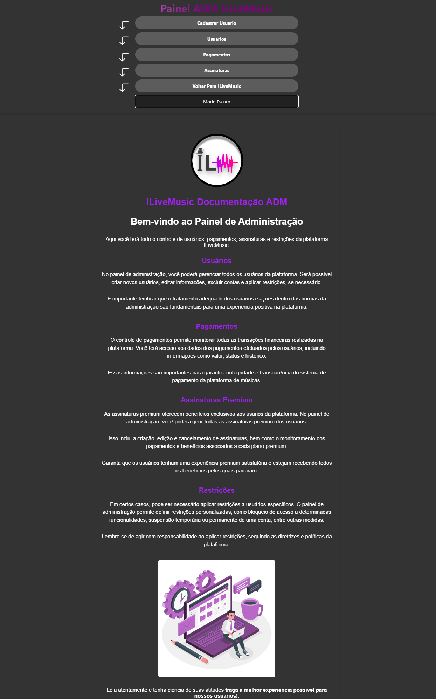

# ILiveMusic - Music Streaming Application

This is the README file for the ILiveMusic music streaming application developed in Java using the Netbeans 8.2 IDE. The application follows a web structure and utilizes the MVC (Model-View-Controller) pattern with DAO (Data Access Object).

## Summary

- The ILiveMusic application provides access to 24/7 radios and playlists of various genres for both free and PREMIUM users. Users can register, edit their profiles, perform administration tasks, manage restrictions, subscribe to premium plans, make payment requests, create playlists, and much more.

## Features

- The application includes the following features:

### Login/Registration Page

- The Login/Registration page allows users to register on the platform, check the availability of their desired username, and access the terms and conditions of use. This page provides information about the data collected from users and how it is processed.

- In the registration section, users can fill in fields such as name, username, email, password, and confirm password. There is also a checkbox to confirm agreement with the established rules. Additionally, the page includes a login area where users can enter their login credentials (username and password).

- The Login/Registration page utilizes animated illustrative cards to provide visual feedback to users. These cards indicate if the user is restricted, if the password is incorrect, or if the registration was successful. Additionally, there is a side carousel that offers a preview of the pages for a free user and a PREMIUM user, showcasing the different functionalities available for each user type.

### Index Page

- The Index page is the home page of the application, offering an immersive experience to users. It features the following elements:

- Events Carousel: Displays a carousel with event cards, allowing users to quickly access information about important events.

- 24/7 Radios Carousels: Presents carousels with lists of 24/7 radios, both free and premium. Free users have access only to the free radios, while premium users have access to all radios. Each radio card displays a tag indicating if it is free or premium.

- Playlists Carousels: Shows carousels with lists of playlists from various artists, available to both free and premium users. Free users can access only - the free playlists, while premium users have access to all playlists. Each playlist card displays a tag indicating if it is free or premium.

- Music Player: Features a fully customized and enhanced music player used to play the 24/7 radios available to free users. The player provides controls to play/pause, skip to the next song, rewind to the previous song, fast forward or rewind within the song, and adjust the volume. When the last song on the list is played, the next song will be the first one, ensuring an infinite loop. The player is always visible at the bottom of the page.

- Sidebar Menu: Includes a sidebar menu with options to edit the user's profile and select the light/dark mode of the interface. The light/dark mode preference is stored locally in the browser's storage (localStorage) and reflects on all pages of the application.

- Premium Effects Menu: Available only for premium users, offers options for Center Effects and Side Effects. These effects customize the Index page, making it unique for premium users.

- Navbar Menu: The navbar contains a menu that provides access to the administration panel for administrators, an option to edit the profile, access to "My Playlists" for premium users, and a logout option. Below the menu, there is a marquee animation displaying the greeting "Welcome + user's name" and the user's account type (ADM, PREMIUM, or free). The navbar also displays the "BECOME PREMIUM" message for users who don't have a premium subscription yet, showing how many days are remaining for premium subscribers. By clicking on "BECOME PREMIUM", users are redirected to the subscription plans page. The "LOGOUT" button allows users to disconnect from their current account.

- The Index page provides an immersive and engaging experience for users, offering quick access to radios, playlists, and an enhanced music player, all within a visually appealing and user-friendly interface.

### Edit Profile Page

- The Edit Profile page allows users to make changes to their own profile. The following features are available:

- Profile Image Editing: Users can select a new profile image to be displayed on their account. The page supports images in formats such as JPG, PNG, JPEG, and GIF, with a maximum size of 5 MB.

- Name Change: Users can edit their name, allowing them to update their personal information as needed.

- Email Update: It is possible to change the email address associated with the account. The user can enter the new desired email.

- Password Change: If the user wishes to change their password, they can enter the current password and set a new password. Confirmation of the new password is required to ensure there are no typing errors.

- Username: The username field is not editable on this page since it is unique and serves as the user's unique identifier on the platform.

- The Edit Profile page offers an intuitive and user-friendly interface, allowing users to make convenient and secure changes to their profile.

### Subscription Plans Page

- The Subscription Plans page displays the different subscription plans available on the platform. The following features are present:

- Plan Cards: Cards are displayed with detailed information about each available plan. This includes the free, monthly, and quarterly plans. Each card highlights the advantages and benefits offered by the plan, detailing what is included and what users can enjoy upon subscribing.

- Discount on Quarterly Plan: The quarterly plan displays a special discount value of -R$10.00 "BRL", making this option more attractive to users. This information is highlighted on the quarterly plan card.

- Subscription Request Process: Upon selecting one of the plan cards, the user advances to the next step of the subscription request process. In this step, an informative card is displayed, emphasizing the importance of including the unique HASH code in the PIX payment description. This HASH code is randomly generated and serves to identify the payment and link it to the user's subscription.

- Purchase Confirmation: By clicking "Confirm Purchase", a card is displayed, reinforcing the user's attention to the need for including the HASH code in the PIX payment description. If the user clicks "Cancel" or "Reset" before confirming the purchase, the request process is canceled. However, by clicking "Confirm Purchase", the user advances to a new payment completion screen.

- Payment Completion Screen: On this screen, after going through two checkout animations, a confetti animation is displayed three times. On the left side, a card presents the PIX payment QR CODE, and on the right side, a card informs that the subscription request has been successfully submitted. The text also informs that a team member will verify the payment, and if it is successfully processed, the subscription will be activated on the user's account according to the purchased plan.

- Random HASH Code: Just below, highlighted in red, the random and unique HASH CODE is displayed. This code is generated by the system, and if an identical code already exists, a new one will be automatically generated. The user should include this code in the PIX payment for it to be correctly identified and linked to their subscription. It is important to note that if the payment is not identified (i.e., the user does not make the payment), the system will automatically delete the generated request if the payment request status remains pending for more than 30 days.

- The Subscription Plans page provides a comprehensive user experience, providing clear information and guidance on the subscription process, ensuring a smooth transition to payment completion and subscription activation.

### ADM Panel Page

- Upon entering the ADM Panel page, the administrator will have access to menus and administration documentation, which summarizes each function and describes how to act within the community as a team collaborator. Additionally, the page has a button to switch between light and dark modes, affecting all other pages of the application according to the administrator's selection.

- #### The page offers the following features:

  - User Registration: By selecting this option in the menu, the administrator gains access to the user registration form. In this case, there is no need to check the terms agreement checkbox, and the administrator can choose the type of user to be registered (regular, premium, or administrator). The password does not need to be confirmed during registration as the user can change it later if necessary.

  - Users: By selecting this option in the menu, a list of all registered users on the platform is displayed. Each user is represented with their photo, name, ID, username, email, and a password hidden by asterisks (***), as passwords are private. Additionally, the user's subscription status is displayed. For administrators, the status appears as "Premium: Permanent". For regular premium users, the remaining number of days in their subscription is shown. The user's account type (regular, premium, administrator, or banned) is also displayed. When a user is banned, it means they have an active restriction that has not yet expired. It is possible to search for a user by filtering their name, as well as edit or delete a user. To prevent accidental deletions, a confirmation popup is displayed when selecting the deletion option.

  - The ADM Panel page provides administrators with all the necessary tools to manage user accounts on the platform, including user registration, viewing relevant information, and taking actions such as editing and deleting users, with security measures to prevent errors or accidental deletions.

### Edit User Page - ADM Panel

- The Edit User page in the ADM Panel displays all relevant data of the selected user from the user list in the administrative panel. The displayed data includes name, username, email, password, account type, and user restrictions, if any. The restrictions are displayed with information about whether they are active or expired.

- On this page, it is possible to edit all user data, including creating or updating restrictions. When updating a restriction, it is possible to remove its active status, but the restriction itself will not be deleted. This is important to maintain a detailed history of each user and identify if there have been any previous restriction recurrences.

- When creating a restriction, it is possible to select an end date for it to expire. The system will automatically remove the restriction when that date is reached. Additionally, it is possible to select the reason for the restriction. When a user with an active restriction tries to log in to their account, a personalized card is displayed informing them that the account is restricted. The card provides the date when the restriction will be removed and the reason for the restriction, so the user is aware of the reason for their restriction.

- The Edit User page in the ADM Panel is visually enhanced, featuring animated illustrative cards that update as changes are made by the administrator. This page provides an intuitive and efficient interface for managing user data, including applying and removing restrictions, offering full control over user accounts in the system.

### Payments Page in the Administration Panel

- The Payments page lists all payment requests made by users when selecting the subscription plans on the Subscription Plans screen. Each request generates a unique random HASH code, which can be used to filter the search. The HASH code is generated by concatenating the user's ID with a unique random code, allowing for quicker identification of the HASH.

- The payment requests are displayed with the following fields:

  - HASH Code: Unique identifier of the payment request.

  - User ID: Identifier of the user who made the request.

  - Payment Status: Indicates if the payment is still pending verification by the responsible team.

  - Payment Expiration Date: Indicates the 31-day expiration date, after which the system automatically deletes the payment request from the database, 
  avoiding unnecessary data accumulation.

  - When a payment is identified by the bank, and the user sends the HASH code in the payment description, the responsible team checks the HASH code on this page. Based on this verification, the subscription corresponding to the HASH code is activated or not. The number of premium days corresponding to the duration of the subscription selected by the user is also displayed.

  - By clicking "Activate Subscription", the administrator has access to all relevant data to record the activation of the subscription. In case of promotions or special offers, such as "Subscribe to the 90-day quarterly plan and get an extra 10 days", the administrator can enter the corresponding number of days for the promotion to ensure the user receives the benefit. After the subscription is activated, a card is displayed informing whether the subscription was successfully activated or not.

### Subscriptions Page - ADM Panel

- The Subscriptions page in the ADM Panel lists all finalized subscriptions that have been activated based on a payment request. It displays the following fields:

  - HASH: Refers to the HASH code of the payment request that was made for that subscription.
 
  - Subscription ID: Unique identifier of the subscription.

  - User Name: Name of the user associated with the subscription.

  - User ID: Unique identifier of the user.

  - Payment Status: Can be "active" if the subscription end date has not been reached yet, or "expired" if the end date has already been reached.

  - Subscription Start: Start date of the subscription.

  - Subscription End: End date of the subscription.

  - On the Subscriptions page, there is a button to delete a subscription, with a pre-confirmation to prevent accidental deletions. The system itself checks if the subscription has already reached its end date, and in that case, the system will automatically remove the subscription.

  - This page provides an overview of active and expired subscriptions in the system, allowing the administrator to efficiently manage user subscriptions.

### My Playlists Page

- The My Playlists page allows users to create and manage their music playlists. However, it is important to note that, as of the current date (14/07/2023), the music feature is under development, and some functionalities are still being implemented.

- Currently, users can create playlists by providing a title and selecting a cover for the playlist. Cover images are subject to format restrictions such as JPEG, JPG, PNG, GIF, and a maximum size of 5MB. Additionally, there is a limit of 10 playlists per user.

- The playlists are registered as public by default, but there will be a future change to allow users to choose whether they want their playlists to be private or public during the creation process.

- On the My Playlists page, users have the option to delete a playlist, but a pre-confirmation is required to prevent accidental deletions. The playlist editing button is still under development and will be implemented later.

- When selecting a playlist, the user will be redirected to a page that displays the playlist cover, title, and a color palette generated by a library algorithm to recognize the predominant colors. However, the addition of songs is still under development and will be implemented in a later stage.

- The My Playlists page will provide users with the ability to create and customize their own music collections in an easy and intuitive way, once the song addition feature is fully implemented.

## Requirements

Language: Java
IDE: Netbeans 8.2
Structure: Web
Design Pattern: MVC (Model-View-Controller) with DAO (Data Access Object)

## Dependencies

The following dependencies are required for the project:
MySQL 5.1.23 JDBC Driver: Used to establish a connection with the MySQL database version 5.1.23.

## How to Run

Clone the repository to your local machine.
Open the project in Netbeans 8.2.
Configure the required dependencies.
Compile and run the project.
Follow the instructions in the graphical interface to use the application's functionalities.
Contribution
Contributions to improve and expand the application are welcome. Feel free to send pull requests and report issues in the project repository.

## Resources Under Development
We are constantly working on new features and functionalities to enhance the user experience. Below are some features that are currently under development:

### Editing Own Playlists
We are developing the functionality that will allow users to edit their existing playlists. This will include the ability to change the playlist title, add or remove songs, and update the playlist cover.

### Adding Songs to Playlists
We are working on implementing the option to add songs to playlists. Users will be able to search for and select songs to include in their playlists, making them personalized according to their musical preferences.

### Searching for Other Users' Playlists
We are developing a search page that will allow users to find playlists created by other users. This functionality will allow filtering playlists by genre, popularity, or other criteria, as well as viewing the songs contained in each playlist and the name of the user who created it.

### Option to Follow Users
We are implementing the option to follow other users on the platform. Users will be able to choose to follow profiles of other users, which will allow them to receive updates about the playlists created by those users and view their posts.

### Favoriting Songs and Creating Favorite Playlist
We are working on the functionality to favorite songs, allowing users to save their favorite songs in a separate playlist. This favorite playlist will be easily accessible and will allow users to organize and quickly access their favorite songs.

### Followed Users' Posts Page
We are developing a page that will display posts from users you follow. In this page, you will be able to see the playlists created by those users, as well as any updates or changes made to those playlists.

We are committed to providing a dynamic and enriching music environment, and these features under development aim to further enhance our users' experience. Stay tuned for future updates!

## Project Images

### Login/Register Page

### Index Page

### Edit Profile Page

### Artist Playlist

### premium subscription plans page

### admin panel

### Payments Page (ADM)

## List Users (ADM)

### Subscriptions Page (ADM)

### User Restriction Page (ADM)

### My Playlists Page

